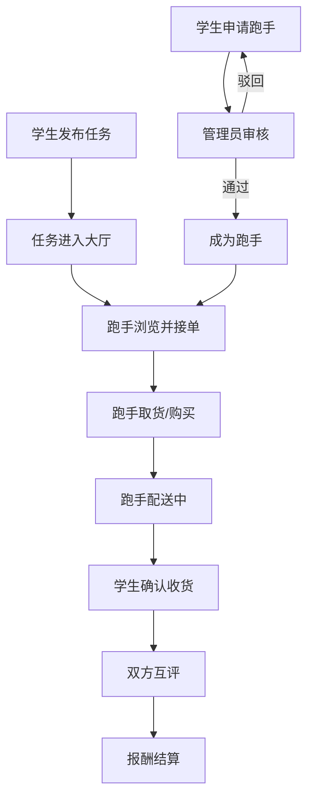

## 1. 产品概述

校园快递代取与跑腿服务平台，解决校园内快递取件难、跑腿需求多的问题。学生可发布代取快递或跑腿代买任务，附近跑手接单完成配送，平台提供信誉评价和交易保障。

- **目标用户**：在校学生（发布者）、兼职跑手、校方管理员
- **核心价值**：高效匹配供需、保障交易安全、提升校园生活便利度

## 2. 核心功能

### 2.1 用户角色

| 角色 | 注册方式 | 核心权限 |
|------|----------|----------|
| 学生用户 | 学号/手机号注册 | 发布代取/跑腿任务、确认收货、评价跑手 |
| 跑手 | 实名认证+校方审核 | 查看附近订单、接单配送、查看信誉评分 |
| 管理员 | 后台账号登录 | 审核跑手资格、管理用户、处理争议退款、查看交易流水 |

### 2.2 功能模块

1. **首页大厅**：任务列表展示、分类筛选、搜索、发布入口
2. **发布任务**：代取快递表单、跑腿代买表单、价格设置
3. **订单详情**：任务信息、状态追踪、联系跑手/发布者
4. **跑手中心**：可接订单、进行中订单、接单历史、信誉评分
5. **个人中心**：我的发布、我的接单、钱包余额、评价管理
6. **管理后台**：跑手审核、用户管理、交易流水、争议处理

### 2.3 页面详情

| 页面名称 | 模块名称 | 功能描述 |
|----------|----------|----------|
| 首页大厅 | 顶部导航 | Logo、角色切换、消息通知、个人中心入口 |
| 首页大厅 | 任务分类 | 全部/代取快递/跑腿代买 标签切换 |
| 首页大厅 | 任务列表 | 卡片式展示，显示任务类型、报酬、距离、时间 |
| 首页大厅 | 筛选排序 | 按距离、价格、时间排序筛选 |
| 发布任务页 | 任务类型选择 | 代取快递 / 跑腿代买 切换 |
| 发布任务页 | 快递表单 | 快递站点、单号、取件时间、送达地址、备注 |
| 发布任务页 | 跑腿表单 | 商品描述、购买地点、配送地址、预算金额 |
| 发布任务页 | 报酬设置 | 输入报酬金额、确认发布 |
| 订单详情页 | 任务信息 | 完整任务描述、发布者信息、状态时间线 |
| 订单详情页 | 操作区域 | 接单/取件/送达/确认收货按钮 |
| 订单详情页 | 沟通区 | 联系方式、订单留言 |
| 跑手中心页 | 可接订单 | 附近待接单列表、一键接单 |
| 跑手中心页 | 进行中 | 当前正在配送的订单 |
| 跑手中心页 | 历史订单 | 已完成订单记录、收入统计 |
| 跑手中心页 | 信誉评分 | 星级评分、评价标签、接单成功率 |
| 个人中心页 | 用户信息 | 头像、昵称、身份标识 |
| 个人中心页 | 我的发布 | 我发布的所有任务及状态 |
| 个人中心页 | 我的钱包 | 余额、充值、提现、交易记录 |
| 个人中心页 | 评价管理 | 待评价、已评价列表 |
| 管理后台 | 跑手审核 | 待审核列表、通过/驳回操作 |
| 管理后台 | 用户管理 | 用户列表、禁用/解封用户 |
| 管理后台 | 交易流水 | 所有交易记录、筛选导出 |
| 管理后台 | 争议处理 | 争议订单、退款操作 |

## 3. 核心流程

### 3.1 代取快递流程

学生发布代取任务 → 跑手浏览附近订单 → 跑手接单 → 跑手到快递站取件 → 跑手配送 → 学生确认收货 → 双方互评 → 报酬结算

### 3.2 跑腿代买流程

学生发布跑腿任务 → 跑手接单 → 跑手购买商品 → 跑手配送 → 学生确认收货 → 双方互评 → 报酬结算

### 3.3 跑手入驻流程

学生申请成为跑手 → 提交实名认证资料 → 管理员审核 → 审核通过成为跑手 → 开始接单

### 3.4 流程图

## 4. 用户界面设计

### 4.1 设计风格

- **主色调**：活力橙 (#FF6B35) 搭配清新青 (#00B4D8)，体现校园青春活力
- **辅助色**：暖黄色 (#FFD166) 用于提醒，成功绿 (#06D6A0) 用于状态
- **按钮风格**：圆角胶囊形按钮，主按钮有渐变效果，悬浮有微动效
- **字体**：标题使用圆润无衬线字体，正文清晰易读
- **布局风格**：卡片式布局，大圆角，柔和阴影，舒适留白
- **图标风格**：线性图标，统一圆角风格，配合色彩点缀

### 4.2 页面设计概览

| 页面名称 | 模块名称 | UI 元素 |
|----------|----------|---------|
| 首页大厅 | 顶部导航 | 渐变背景、角色切换胶囊按钮、消息徽标 |
| 首页大厅 | 分类标签 | 横向滚动标签、选中态高亮色块 |
| 首页大厅 | 任务卡片 | 白色卡片、柔和阴影、左侧类型图标、右侧报酬高亮 |
| 发布任务页 | 表单区域 | 分步骤表单、进度指示、大输入框 |
| 订单详情页 | 状态时间线 | 竖向时间线、彩色节点、已完成状态打勾 |
| 跑手中心 | 信誉卡片 | 渐变头部、大字号评分、评价标签云 |
| 个人中心 | 钱包模块 | 卡片堆叠效果、余额数字放大 |
| 管理后台 | 数据概览 | 数据卡片网格、图表区域 |

### 4.3 响应式设计

- 桌面端优先，自适应平板和手机屏幕
- 移动端采用底部导航，简化操作
- 卡片布局在窄屏下自动调整为单列
- 触控区域优化，按钮最小尺寸 44px

### 4.4 动效设计

- 页面切换使用淡入淡出+轻微位移
- 卡片悬浮有上浮和阴影加深效果
- 按钮点击有缩放反馈
- 状态更新有平滑过渡动画
- 列表加载有骨架屏占位效果
