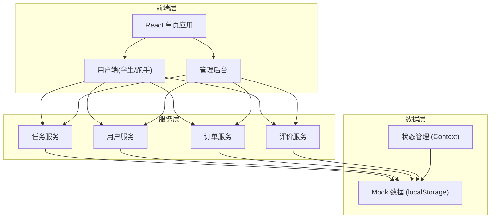
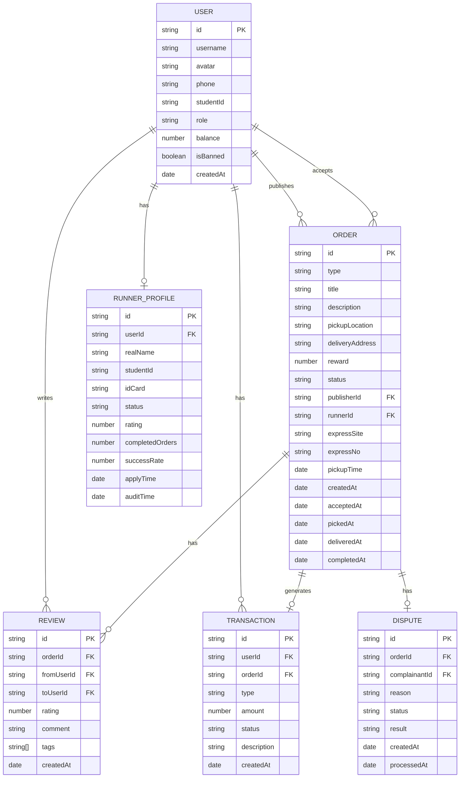

## 1. 架构设计



## 2. 技术选型

- **前端框架**：React@18 + TypeScript
- **构建工具**：Vite@5
- **样式方案**：TailwindCSS@3
- **路由管理**：React Router@6
- **状态管理**：React Context + useReducer
- **图标库**：Lucide React
- **数据存储**：localStorage (Mock 数据)
- **UI 组件**：自定义组件库

## 3. 路由定义

| 路由路径 | 页面名称 | 说明 |
|----------|----------|------|
| `/` | 首页大厅 | 任务列表、分类筛选 |
| `/publish` | 发布任务 | 代取快递/跑腿代买表单 |
| `/order/:id` | 订单详情 | 任务详情、状态追踪 |
| `/runner` | 跑手中心 | 可接订单、进行中、历史 |
| `/profile` | 个人中心 | 用户信息、我的发布、钱包 |
| `/profile/wallet` | 我的钱包 | 余额、交易记录 |
| `/profile/orders` | 我的订单 | 发布/接单记录 |
| `/profile/reviews` | 评价管理 | 待评价/已评价 |
| `/admin` | 管理后台首页 | 数据概览 |
| `/admin/runners` | 跑手审核 | 跑手资格审核 |
| `/admin/users` | 用户管理 | 用户列表管理 |
| `/admin/transactions` | 交易流水 | 交易记录查询 |
| `/admin/disputes` | 争议处理 | 争议订单处理 |

## 4. 数据模型

### 4.1 ER 图



### 4.2 类型定义

```typescript
// 用户类型
interface User {
  id: string;
  username: string;
  avatar: string;
  phone: string;
  studentId: string;
  role: 'student' | 'runner' | 'admin';
  balance: number;
  isBanned: boolean;
  createdAt: string;
}

// 跑手资料
interface RunnerProfile {
  id: string;
  userId: string;
  realName: string;
  studentId: string;
  idCard: string;
  status: 'pending' | 'approved' | 'rejected';
  rating: number;
  completedOrders: number;
  successRate: number;
  applyTime: string;
  auditTime?: string;
}

// 订单类型
type OrderType = 'express' | 'errand';
type OrderStatus = 'pending' | 'accepted' | 'picked' | 'delivering' | 'completed' | 'cancelled' | 'disputed';

interface Order {
  id: string;
  type: OrderType;
  title: string;
  description: string;
  pickupLocation: string;
  deliveryAddress: string;
  reward: number;
  status: OrderStatus;
  publisherId: string;
  runnerId?: string;
  expressSite?: string;
  expressNo?: string;
  pickupTime: string;
  createdAt: string;
  acceptedAt?: string;
  pickedAt?: string;
  deliveredAt?: string;
  completedAt?: string;
}

// 评价
interface Review {
  id: string;
  orderId: string;
  fromUserId: string;
  toUserId: string;
  rating: number;
  comment: string;
  tags: string[];
  createdAt: string;
}

// 交易记录
interface Transaction {
  id: string;
  userId: string;
  orderId?: string;
  type: 'recharge' | 'withdraw' | 'payment' | 'income' | 'refund';
  amount: number;
  status: 'pending' | 'success' | 'failed';
  description: string;
  createdAt: string;
}

// 争议
interface Dispute {
  id: string;
  orderId: string;
  complainantId: string;
  reason: string;
  status: 'pending' | 'resolved' | 'rejected';
  result?: string;
  createdAt: string;
  processedAt?: string;
}
```

## 5. 项目结构

```
src/
├── assets/           # 静态资源
├── components/       # 通用组件
│   ├── Button/
│   ├── Card/
│   ├── Modal/
│   ├── Navbar/
│   ├── Rating/
│   └── Timeline/
├── contexts/         # Context 状态管理
│   ├── AuthContext.tsx
│   └── OrderContext.tsx
├── pages/            # 页面组件
│   ├── Home/
│   ├── Publish/
│   ├── OrderDetail/
│   ├── RunnerCenter/
│   ├── Profile/
│   └── Admin/
├── hooks/            # 自定义 Hooks
│   ├── useAuth.ts
│   └── useOrders.ts
├── mock/             # Mock 数据
│   ├── users.ts
│   ├── orders.ts
│   └── reviews.ts
├── utils/            # 工具函数
│   ├── storage.ts
│   ├── format.ts
│   └── id.ts
├── types/            # 类型定义
│   └── index.ts
├── App.tsx
├── main.tsx
└── index.css
```

## 6. 核心模块说明

### 6.1 认证模块
- 支持学生用户注册登录
- 角色切换（学生/跑手/管理员）
- 跑手申请与审核流程
- localStorage 持久化登录状态

### 6.2 任务大厅模块
- 任务列表展示（卡片式）
- 分类筛选（快递/跑腿）
- 排序功能（距离/价格/时间）
- 搜索功能

### 6.3 订单模块
- 发布订单表单
- 订单状态流转
- 接单/取件/送达操作
- 订单详情展示
- 状态时间线

### 6.4 跑手中心模块
- 可接订单列表
- 进行中订单
- 历史订单统计
- 信誉评分展示

### 6.5 个人中心模块
- 用户信息管理
- 钱包余额管理
- 我的订单（发布/接单）
- 评价管理

### 6.6 管理后台模块
- 数据概览仪表盘
- 跑手资格审核
- 用户管理（禁用/解封）
- 交易流水查询
- 争议处理与退款
